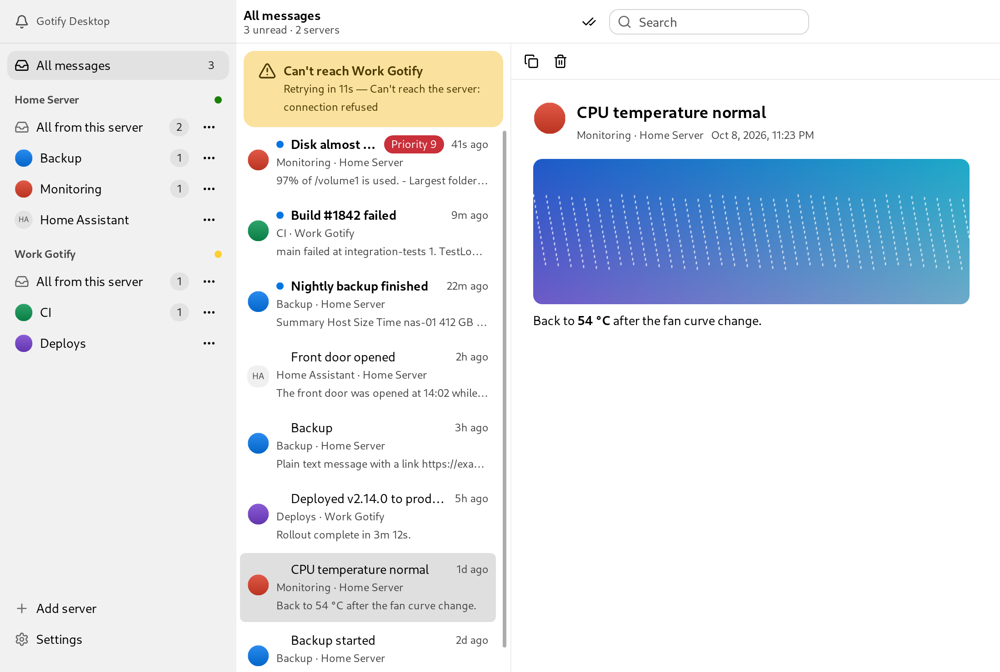

# Gotify Desktop

[English](README.md) | 简体中文

[Gotify](https://gotify.net) 的桌面客户端，只接收消息。它常驻托盘，保持和一个或多个 Gotify 服务器的连接，把消息显示为系统原生通知。优先支持 Windows，其次 macOS，Linux 也能用。

<picture>
  <source media="(prefers-color-scheme: dark)" srcset="docs/main-dark.png">
  
</picture>

## 为什么不直接开着 Gotify 网页？

gotify/server 自带的 WebUI 很适合管理服务器，但用来在桌面上接收通知就不太合适：

- **不用一直开着浏览器标签。** WebUI 只有标签页开着时才能收到消息，而浏览器会节流甚至冻结后台标签。Gotify Desktop 是单实例的托盘程序，关掉窗口也照常接收。托盘图标会显示三种状态：全部已读、有未读、有服务器离线。
- **断线自动恢复。** 每个服务器都有一个 supervisor，用 ping/pong 检测 websocket 是否还活着，断开后按退避策略重连，电脑从睡眠中唤醒时会立即重连。重连后通过 REST 补回断线期间漏掉的消息，每条只存一次，不会漏，也不会重复。
- **原生通知，并且有通知策略。** Windows 用 Toast，macOS 用 UNUserNotificationCenter，Linux 用 D-Bus。不需要浏览器授权通知，通知上也不会带浏览器的名字。通知按 Gotify 的 priority 分级：0 不通知，1–3 静默，4–7 普通，8 及以上为高优先级。此外还支持：
  - 免打扰时段（可以跨午夜），可以设置让高优先级消息照常通知；
  - 暂停通知，以及按应用单独静音或设置最低优先级；
  - 合并刷屏：同一应用 10 秒内超过 3 条时合并成一条通知，补回的消息超过 3 条时只显示一条"错过了 N 条"的汇总；
  - 显示消息 extras 中的大图，点击通知打开 extras 中的链接。
- **同时连接多个服务器。** WebUI 一次只能登录一个服务器；这里每个服务器都有自己的连接，消息汇总在同一个列表里。
- **本地历史。** 消息保存在本地 SQLite 数据库中，服务器宕机时也能查看历史。client token 以明文存放在同目录的 `tokens.json` 中，只有当前用户可读：能读到这个文件的人就能以你的 Gotify 用户身份操作。
- **桌面窗口体验。** 消息正文用 Markdown 渲染，图片可以在应用内查看；支持深浅色主题和中英文；消息很多时列表依然流畅。

WebUI 仍然更擅长的地方：不用安装，任何有浏览器的设备都能用，而且能管理服务器，包括应用、客户端、用户和插件。Gotify Desktop 只负责接收消息，这些操作请继续在 WebUI 里完成。

## 安装

在 [Releases](../../releases) 下载对应系统的安装包：Windows 用 setup `.exe`，macOS 用 `.dmg`，Linux 用 `.deb`，或 `.tar.gz` 配合 `install.sh`。

安装包没有签名，第一次打开时系统会警告：

- **Windows：** SmartScreen 提示「Windows 已保护你的电脑」，点 **更多信息**，再点 **仍要运行**。
- **macOS：** 第一次尝试打开后，到 **系统设置 → 隐私与安全性** 点 **仍要打开**。也可以运行 `xattr -dr com.apple.quarantine "/Applications/Gotify Desktop.app"`。

## 构建

需要 Go 和 [Bun](https://bun.sh)。整个项目不依赖 cgo。

```sh
cd frontend && bun install && bun run build && cd ..
go run github.com/egoist/mygo/cmd/mygo dev                  # 运行应用
GOTIFY_DEMO=1 go run github.com/egoist/mygo/cmd/mygo dev    # 同上，使用演示数据
go run github.com/egoist/mygo/cmd/mygo build -platform windows/amd64,windows/arm64,darwin/universal,linux/amd64 -o build
```

macOS 的签名和 `.dmg` 需要在 Mac 上生成，Windows 安装包需要 `makensis`。测试和其他命令见 [AGENTS.md](AGENTS.md)。

## 许可证

Copyright © 2026 RedwindA。Gotify Desktop 是自由软件，以 [GNU 通用公共许可证第 3 版](LICENSE)发布。
